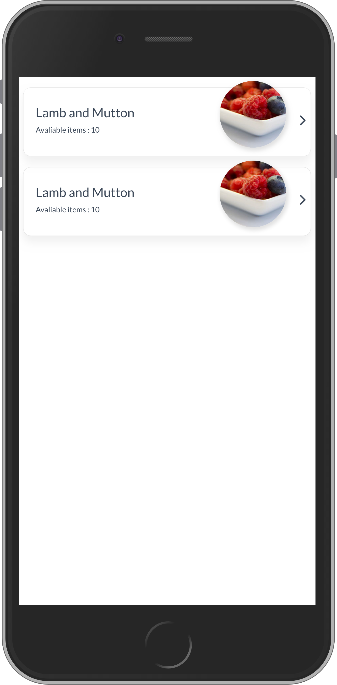
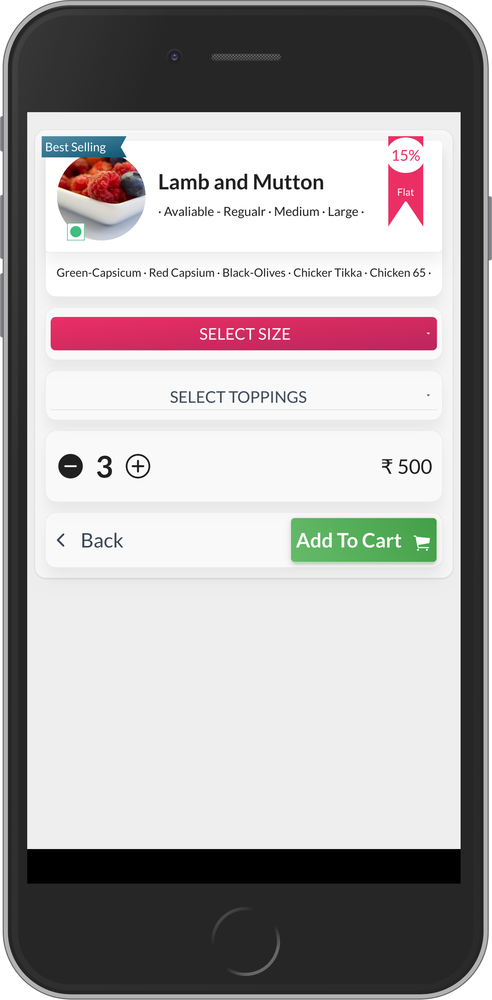
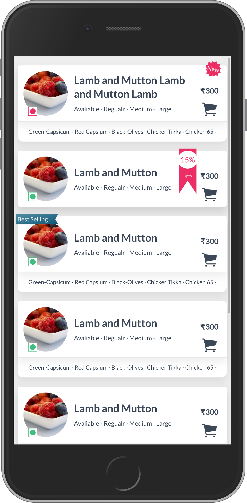
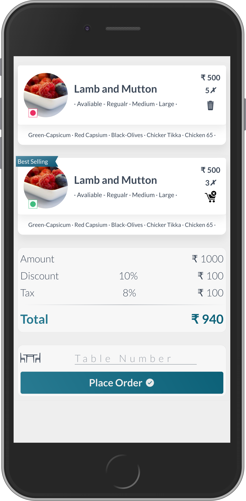
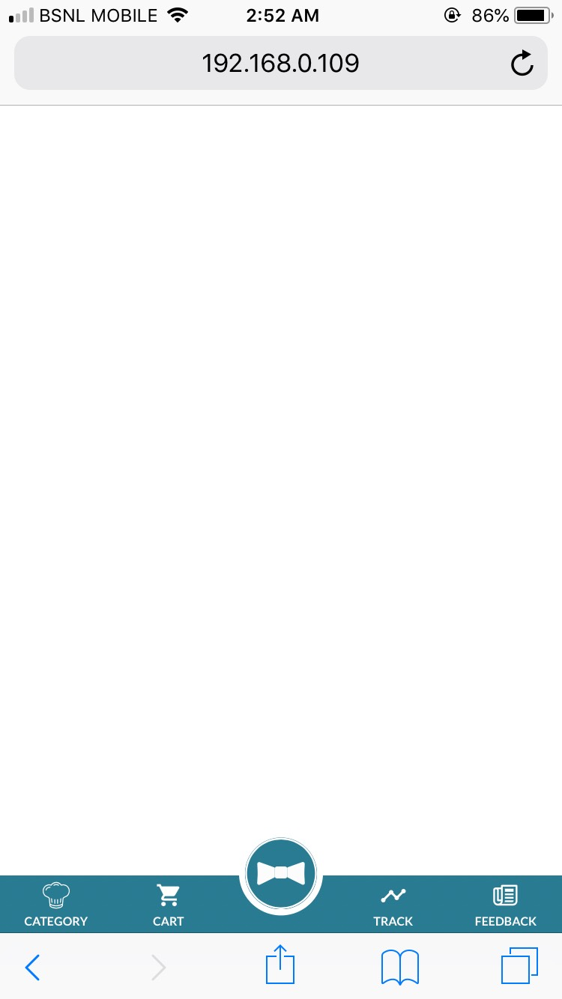
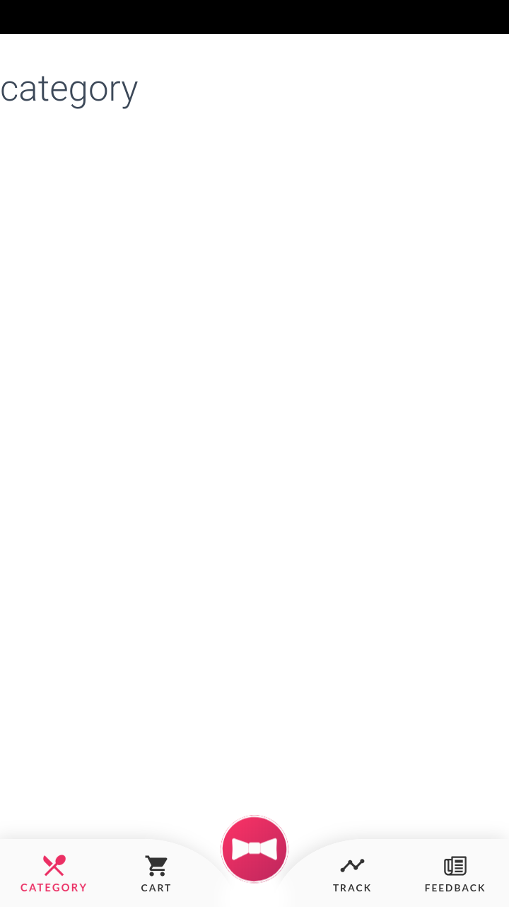
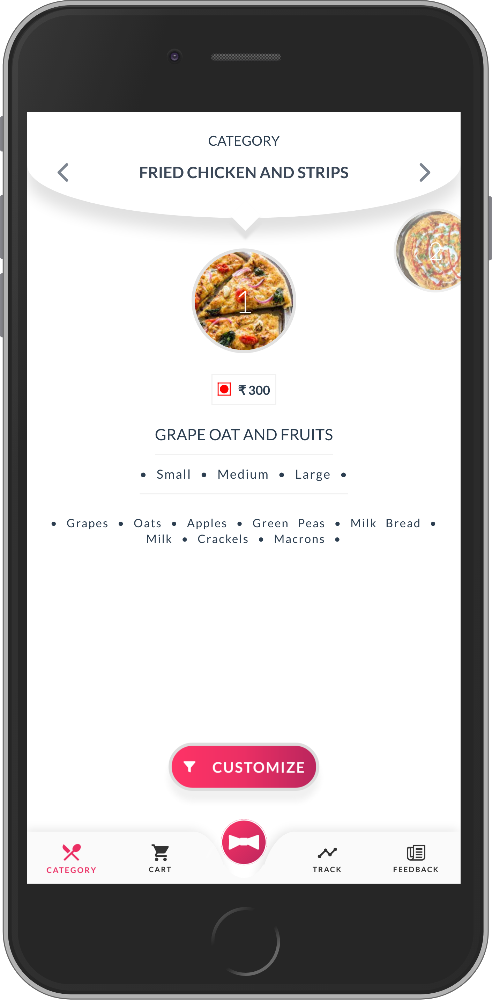
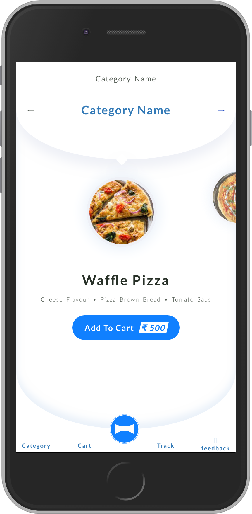

# There are three samples of the application

###### NOTE: This previews are developed with using CSS no third party libraries were used.

### Preview

#### Sample - 1
###### This sample was the first mock I've created using SASS, JS.

  
  &nbsp;&nbsp;
  
  &nbsp;&nbsp;
  
  &nbsp;&nbsp;
  

#### Sample - 2
###### This are the second mock that I've created Using SASS, JS.

  
  &nbsp;&nbsp;&nbsp;&nbsp;
  
  &nbsp;&nbsp;&nbsp;&nbsp;
  

#### Sample - 1
###### This is the final UI I've created using SASS, JS.

  

